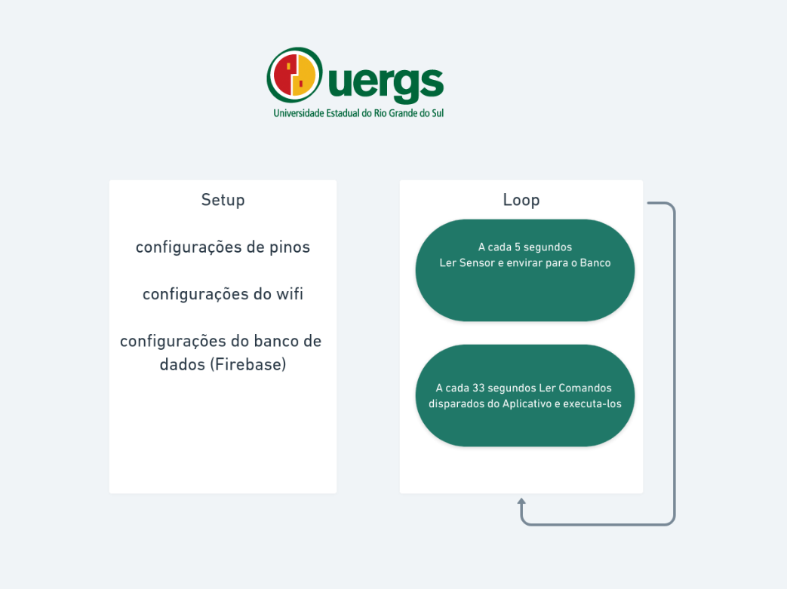

# Projeto UERGS Microcontrolador

Esse projeto IOT tem o objetivo de criar um dispositivo capaz de calcular o consumo de energia.
Usamos o ESP8266 para controlar e coletar informações do sensor de consumo de energia.

Desenvolvemos o script do ESP8266 na platarfoma https://platformio.org/

Enviamos os dados para o Banco de Dados Firebase

Apresentamos os Dados em um Apliativo feito em React Native 

## Integrantes do Grupo
 - Maicon Jobim
 - Leonardo Bazacas 
 - Jully Jara 
 - Augusto Bierhals

## Logica do codigo

## Imagens do aplicativo 

.jpeg)

.jpeg)

